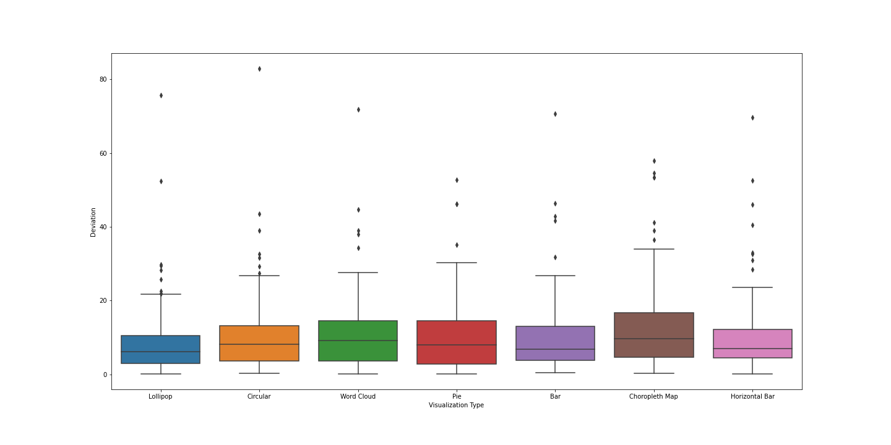
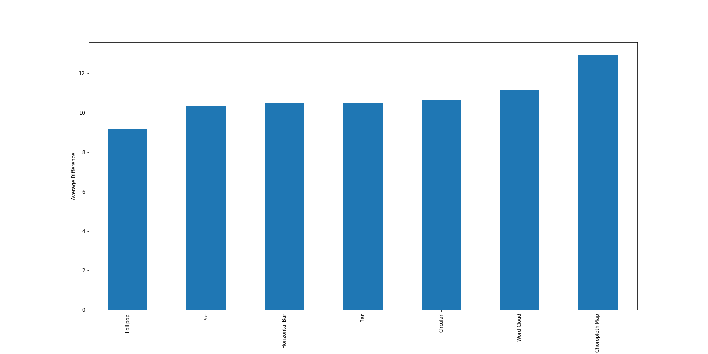

### Assignment 3 - Replicating a Classic Experiment
#### Team member: Yufei Lin & Mingjie Zeng & Botao Han
--------

The purpose of our experiment is to investigate the effect of different visualization charts on people's perceived ability to estimate the average value of the given data. To make the experimental task more concrete and easy to understand, we use the specific data of Netflix's subscription costs in different regions, given the maximum and minimum values, and ask users to guess the average costs in the regions listed in the chart.

Here's our experiment/survey link: https://jasminezzz9.github.io/survey/

We use 7 different kinds of visualizations:
- Bar chart
- Horizontal bar chart
- Pie charts
- Circular bar chart
- Lollipop charts
- Wordcloud
- Choropleth map

And based on the visualizations we used, we have several hypotheses:
- In the task of guessing the average values, does the direction of the bar chart have an effect on the user's perceptions? (bar chart & horizontal bar chart)
- Would a pie chart be more accurate than a circular bar chart for the task of guessing the average values?
- Would a lollipop chart perform better than a bar chart in the task of guessing the average values?
- In the task of guessing averages, would the more graphical presentations, like choropleth map and wordcloud, provide better information to the users than the regular charts?

Details of our experiment
---

Here is the opening page of our experiment, explaining the goal of this experiment and instructing users on the correct process:

In order to better and more contextually analyze the experimental results, we add a background survey of the users, mainly by adding an analysis of gender and familiarity with visualization knowledge:

This section is a description of the user's specific actions and contains a numeric selection bar, given the important information about the maximum and minimum values:

And belows are the 7 visualizations we used to presernt the data. Every visualization contains 10 random subscription costs for Netflix in different regions from the dataset:
- Bar chart:

- Horizontal bar chart:

- Lollipop chart:

- Pie chart:

- Circular bar chart:

- Wordcloud:

- Choropleth map:

Results analysis
---

The result is publically available here: https://docs.google.com/spreadsheets/d/1hz1yXFyTXAAYJk0zwet7VdDoUyjFtHCjp9KHwaTAiRE/edit?usp=sharing and the analysis is available in [ClearAndAnalyzeData.ipynb](https://github.com/YufeiLinUlysses/a3-experiment/blob/main/clean.ipynb)

We look at the effectiveness of each different visualization by looking at how much the user misses from their guess and our actual average. We define the gap as the absolute value of the difference between the guessed and actual value and divde by the actual value. Then, we chooses to look at both a box plot and a bar chart to draw the conclusion. The result is as the following:

From the graph we could see that on average, Bar chart, Horizontal Bar chart and Lollipop chart is easier for people to understand the average of the 10 random countries. 

From this graph, we see the most effective graph is lollipop graph and choropleth map has the least effective performance. 

Technical achievements
---
- We connect to Google Sheet to restore users' data, making it convient for users because they don't need to have any operations about data. And also it's easy for us to collect the experiments data synchronously. And it's also helpful that even if the user does not fully complete this questionnaire, the corresponding data will still be available, which makes the collection of data more efficient as well.
- We choose a more realistic database: Netflix subscription costs in different regions and randomly selected ten data from the database each time while randomly selecting specific chart types and binding them to the charts. The maximum, minimum and average values of the selected data are also calculated.
- We bind additional information for each user: gender and familiarity with the visualization knowledge, and bind this information to the experimental data obtained for each trial and record it in a google sheet.
- We implement different kinds of visualizations by D3, including bar chart, horizontal bar chart, lollipop chart, pie chart, and the more graphical representations, choropleth map and wordcloud.

Design achievements
---
- We use the css from HTML KickStart to make the whole pages consistent and simple, to avoid distracting the user's attention and to provide a better experience for users.
- User operations have been simplified. At the beginning we had two buttons on each trail page, after each user selected the guessed data, they had to click the 'submit' button to connect the data to the Google Sheet, and then click the 'next' button for the next trail, but after the first questionnaire, we found that many users would not click the 'submit' button every time but directly click the 'next' button. We realize that this was an inefficient and repetitive operation for users and could cause misunderstanding, so we combine the functions of the two buttons into one to get the exact result we want while reducing the number of user actions.
- We have tried to use some ways to limit the user input values as much as possible. For example, we use a drop-down list for the background check to avoid users entering anything out of range. As well as using sliders in each trail to collect data to avoid receiving non-numeric or out-of-range numbers and to make the process of collecting data more effective.

Reference
---
- css : http://www.99lime.com/elements/#form-example
- Bar chart: https://www.d3-graph-gallery.com/graph/barplot_basic.html
- Horizontal bar chart: https://www.d3-graph-gallery.com/graph/barplot_horizontal.html
- Choropleth mapL https://www.d3-graph-gallery.com/graph/choropleth_basic.html
- Wordcloud: https://www.d3-graph-gallery.com/graph/wordcloud_size.html
- Lollipop: https://www.d3-graph-gallery.com/graph/lollipop_basic.html
- Pie chart: https://www.d3-graph-gallery.com/graph/pie_annotation.html
- Circular bar chart: https://www.d3-graph-gallery.com/graph/circular_barplot_basic.html
